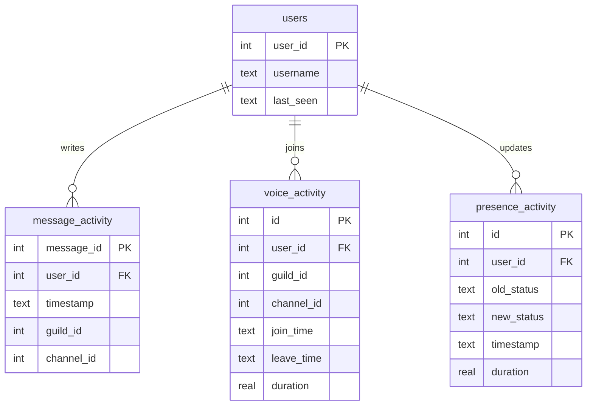

# Discord User Activity & Presence Tracking System (discord.ext.tracker)

A robust, lightweight, and asynchronous user activity and online status (presence) tracking system built as a native extension (Cog) for the `discord.py-self` library.

---

## Features

- **Activity Logger**: Records sent messages and voice channel joins, leaves, and switches asynchronously using an SQLite backend.
- **Presence Logger**: Tracks user online status changes (`online`, `idle`, `dnd`, `offline`) and calculates how long they spent in their previous state.
- ** Lingering Session Cleanup**: Automatically closes dangling voice sessions (e.g. if the bot or server goes offline) to guarantee telemetry duration integrity.
- **Duplicate Prevention**: Filters out duplicate consecutive presence updates caused by multiple active Discord clients.
- **Real-Time Channel Logging**: Support for streaming status changes in real-time to a designated logging text channel.
- **Analytics Engine**: Dynamically calculates peak active hours, peak weekdays, averages per active day, total voice durations, and ranks leaderboards.
- **Visual ASCII Heatmaps**: Generates visual representations of a user's weekly interactions grouped by weekday and hour.
- **Discord Native Timestamps**: Utilizes Discord client-side markdown timestamps (`<t:epoch:R>`) for localized date/time representation.
- **Robust User Resolution**: Decodes mentions, user IDs, and runs historical username substring searches from the database if a user is not currently in the bot cache.

---

## Installation & Setup

### 1. Requirements

- Python 3.10 or higher
- Dependency packages from `requirements_tracker.txt` (only `python-dotenv` if environment variables are used; SQLite is built-in).

### 2. Setup environment

Initialize the virtual environment and install the library in editable mode:

```bash
# Initialize virtual environment
python3 -m venv .venv
source .venv/bin/activate

# Install the library with tests dependencies
pip install -e .[test]
```

### 3. Configuration

Copy `config.json.example` to `config.json` in the root directory:

```bash
cp config.json.example config.json
```

Edit `config.json` with your credentials:

```json
{
  "token": "YOUR_DISCORD_TOKEN_HERE",
  "prefix": "/",
  "db_path": "activity_tracker.db",
  "ignore_bots": true,
  "presence_log_channel_id": 123456789012345678
}
```

*Note: You can also specify configurations via environment variables (`DISCORD_TOKEN`, `DISCORD_PREFIX`, `TRACKER_DB_PATH`, `TRACKER_IGNORE_BOTS`, `PRESENCE_LOG_CHANNEL_ID`).*

### 4. Running the Bot

Run the bot runner:

```bash
python3 bot.py
```

---

## Commands

All commands can be invoked using your configured prefix (default: `/`).

- `[prefix]lastseen <user>`: Shows the last time the target user was seen active and what they did.
- `[prefix]activity <user>`: Displays message counts, total voice duration, daily averages, and active voice status.
- `[prefix]stats <user>`: Displays peak usage hours, peak weekdays, averages, and a visual ASCII heatmap of their activity.
- `[prefix]topactive`: Displays the guild's activity leaderboard of the top 10 most active members.
- `[prefix]presence <user>`: Displays a detailed formatted history of the target user's recent status changes.
- `[prefix]purgeme <channel_id_or_here> [limit] [edit_first] [search]`: Deletes your own messages in a target channel (by ID or typing `here`).
- `[prefix]purgeserverme <server_id_or_here> [limit_per_channel] [edit_first] [search]`: Deletes your own messages across all accessible text channels in a target server.

---

## Stealth Purging (DM Mode)

To avoid sending command messages (like `/purgeme`) in public channels where other users or logging bots can see them, you can send these commands in a private Direct Message (DM) to your own self-bot:

1. **Purging a specific channel privately:**
   Send this in DMs to yourself:
   ```
   /purgeme 123456789012345678 150
   ```
   *This will delete up to 150 of your messages in channel ID `123456789012345678`.*

2. **Purging a whole server privately:**
   Send this in DMs to yourself:
   ```
   /purgeserverme 987654321098765432 50
   ```
   *This will scan all text channels in server ID `987654321098765432` and delete up to 50 of your messages per channel.*

### Settings:
- `edit_first` (True/False, default False): If set to `True`, the bot will edit each message to `.` before deleting it, confusing logging bots' message caches.
- `search` (Optional): Specifying a keyword at the end will restrict deletions only to messages containing that word.
- **Stealth Delay**: The bot automatically applies a randomized delay between 2.0s and 3.0s between each deletion to bypass anti-spam filters and avoid rate limits.
- **Private Reporting**: The bot reports start status and final completion summaries privately to you in your DMs.

---

## Example Outputs

### 1. `/lastseen @UserA`
> **UserA** was last seen sending a message in #general on June 6, 2026 5:15 PM (3 minutes ago).

### 2. `/presence @UserA`
> 📋 **Recent Status Changes for UserA**:
> [2026-06-06 12:41:23 UTC] 37 seconds ago | 👤 **Presence Update**: Status changed from `online` to `idle`
> [2026-06-06 12:41:45 UTC] 15 seconds ago | 👤 **Presence Update**: Status changed from `idle` to `online` (duration: 22s)

### 3. `/activity @UserA`
> 📊 **Activity Summary for UserA**
> • **Messages Logged**: 142
> • **Voice Duration**: 3h 12m
> • **Daily Average Messages**: 14.2/active day
> • **Daily Average Voice**: 45m 12s/active day
> • **Voice Sessions**: 8
> • **Voice Status**: Offline
> • **Last Active**: 3 minutes ago

### 4. `/stats @UserA`
> 📈 **Detailed Analytics for UserA**
> • **Total Messages**: 142
> • **Total Voice Time**: 3h 12m
> • **Peak Hour of Day**: 14:00 - 15:00 UTC (42 events)
> • **Peak Day of Week**: Monday (65 events)
> 
> 🗓️ **Weekly Activity Heatmap**:
> ```
>       00  02  04  06  08  10  12  14  16  18  20  22
>      -------------------------------------------------
> Sun | ░░░░    ▒▒▒▒        ████████░░░░
> Mon |             ▓▓▓▓    ░░░░████    ░░░░
> Tue | ░░░░        ░░░░            ▒▒▒▒
> Wed |     ▒▒▒▒            ████
> Thu | ░░░░    ░░░░
> Fri |             ░░░░        ▓▓▓▓████
> Sat | ▒▒▒▒            ░░░░░░░░    ░░░░
>      -------------------------------------------------
> Key:   ░ [1-3]  ▒ [4-10]  ▓ [11-25]  █ [26+] events (UTC)
> ```

---

## Database Schema

The SQLite database structure contains four normalized tables:



### Table Details

#### 1. `users`
Tracks unique users seen by the tracker.
- `user_id` (INTEGER, Primary Key): Unique Discord user ID.
- `username` (TEXT): Last cached username (e.g. `UserA#0000`).
- `last_seen` (TEXT): ISO 8601 UTC timestamp of their last recorded activity.

#### 2. `message_activity`
Logs message events.
- `message_id` (INTEGER, Primary Key): Unique Discord message ID (prevents duplicate logs).
- `user_id` (INTEGER, Foreign Key): Refers to `users(user_id)`.
- `timestamp` (TEXT): ISO 8601 UTC timestamp when the message was sent.
- `guild_id` (INTEGER, Nullable): Server ID (null in DMs).
- `channel_id` (INTEGER): Channel ID where the message was sent.

#### 3. `voice_activity`
Logs voice sessions.
- `id` (INTEGER, Primary Key): Auto-incremented session ID.
- `user_id` (INTEGER, Foreign Key): Refers to `users(user_id)`.
- `guild_id` (INTEGER): Server ID.
- `channel_id` (INTEGER): Voice channel ID.
- `join_time` (TEXT): ISO 8601 UTC join timestamp.
- `leave_time` (TEXT, Nullable): ISO 8601 UTC leave timestamp (NULL if session is active).
- `duration` (REAL, Nullable): Duration of the session in seconds (NULL if session is active).

#### 4. `presence_activity`
Logs status change transitions.
- `id` (INTEGER, Primary Key): Auto-incremented event ID.
- `user_id` (INTEGER, Foreign Key): Refers to `users(user_id)`.
- `old_status` (TEXT): Prior online status (`online`, `idle`, `dnd`, `offline`).
- `new_status` (TEXT): Changed online status (`online`, `idle`, `dnd`, `offline`).
- `timestamp` (TEXT): ISO 8601 UTC timestamp of transition.
- `duration` (REAL, Nullable): Time in seconds spent in `old_status` prior to this transition.

### Index Optimization
- `idx_message_user` (On `message_activity(user_id)`)
- `idx_message_timestamp` (On `message_activity(timestamp)`)
- `idx_voice_user` (On `voice_activity(user_id)`)
- `idx_voice_leave` (On `voice_activity(user_id, leave_time)`)
- `idx_presence_user` (On `presence_activity(user_id)`)
- `idx_presence_timestamp` (On `presence_activity(timestamp)`)

---

## Architectural Decisions

1. **Native Extension Design**: Built under `discord.ext.tracker` to seamlessly integrate with standard `discord.py` project layouts. 
2. **Asynchronous Non-blocking SQLite**: SQLite operations run in Python's built-in thread executor pool via `asyncio.to_thread`. This delivers high-speed asynchronous reads/writes without polluting the codebase with third-party driver dependencies like `aiosqlite`.
3. **WAL (Write-Ahead Logging) Mode**: Enabled WAL mode on the SQLite connection. This allows simultaneous readers and a writer, mitigating locks under heavy chat concurrency.
4. **Client-side Rendered Timestamps**: Commands format times as `<t:epoch:R>`, offloading calculation and time-zone conversion to the native Discord client UI.
5. **Session Resolution Integrity**: Lingering session auto-cleanup checks on every voice state join. If a user join event occurs while they have an unclosed session (e.g. if the bot went offline while they were in voice), the engine closes the older session at the current time and opens the new session.
6. **Presence Duplicate Filtering**: Compares the incoming status change with the user's latest logged database state. Consecutive identical events are discarded, saving database storage and maintaining logs accuracy.
